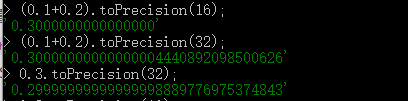
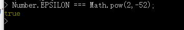

# 为什么0.1+0.2==0.3返回false

Reviewed: No
Status: JavaScript
introduce: https://www.jianshu.com/p/62e286bbe076
频率: ⭐

javascript中不区分整数和浮点数，js中所有的数字都是浮点数。

## 浮点数的特点：

- 可以表示的值的范围比同等位数的整数表示方法的值的范围大得多
- 浮点数无法精确的表示其范围内的所有数值；整数可以精确表示其范围内的每一个数值。
- 浮点数的个数是无限的，javascript不能精确的表示所有浮点数，只能是一个近似数。

## js的最大安全数

js有效数字最长是53位二进制位。

## 为什么0.1+0.2！=0.3

因为本身javascript里的浮点数就是不精确的，另外进行运算时是把十进制转换为二进制，再进行运算，这个过程中就又发生了精度损失。

## 为什么0.1==0.1

标准中规定尾数f的固定长度是52位，再加上省略的一位，这53位是JS精度范围。它最大可以表示2^53(9007199254740992), 长度是 16，所以可以使用 toPrecision(16) 来做精度运算，超过的精度会自动做凑整处理

    0.10000000000000000555.toPrecision(16) // "0.1000000000000000"
    
    0.1.toPrecision(16)  // "0.1000000000000000"
    0.1.toPrecision(23)  // "0.10000000000000000555112"

所以，0.1===0.1是因为超过16位后自动凑整，导致他俩相等了。

## **如何解决0.1+0.2不等于0.3的问题**

**设置一个误差范围值**

设置一个误差范围值，通常称为“机器精度”，对于JavaScript来说，这个误差范围是`Math.pow(2,-52)`。在ES6中，提供了一个属性，`Number.EPSILON`，这个值等于2的﹣52次方

所以，只要判断(0.1+0.2)与0.3的差小Number.EPSILONG，就可以说明两者是相等的

    /**
     * @description 比较两个值是否相等
     * @param {Number} a 
     * @param {Number} b 
     * @return 相差小于某个值，返回true，否则返回false
     */
    function numberEqual(a,b){
      return Math.abs(a-b) < Number.EPSILON
    }
    
    numberEqual((0.1+0.2), 0.3) // true

[JavaScript中0.1+0.2==0.3返回false](https://www.jianshu.com/p/62e286bbe076)