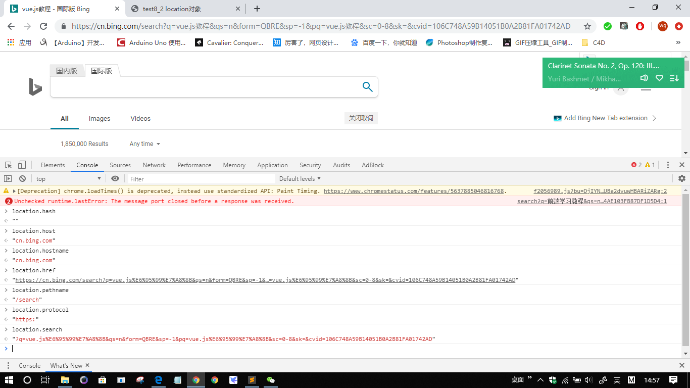
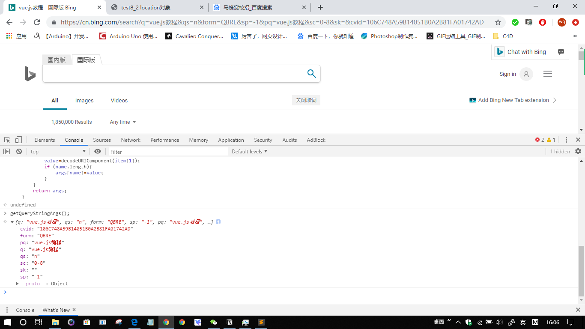

# BOM

Class: JavaScript
Created: Sep 24, 2019 4:17 PM
Reviewed: No

# 8.1window对象

## 8.1.1全局作用域

window对象表示浏览器的一个实例，同时也是Global对象。所有在全局声明的函数或者变量都是他的属性或者方法。但是全局变量不能使用delete删除，而window.shuxing可以使用delete删除。

    var age=12;
    window.name="littleA";
    console.log(delete window.age);	//false
    console.log(delete [window.name](http://window.name/));	//true
    console.log(window.age);	//12
    console.log([window.name](http://window.name/));	//undefine

## 8.1.2框架与窗口关系

## 8.1.3窗口位置

screenX,sxreenY和screenTop,screenLeft，表示窗口位置

    var leftPos = (typeof window.screenLeft == "number") ? window.screenLeft : window.screenX;
    var topPos = (typeof window.screenTop == "number") ? window.screenTop : window.screenY;
    console.log(leftPos+" "+topPos); //0 0
    //移动窗口，以下方法有可能被浏览器禁用，以下方法都不适用于框架，只适用于window对象
    //将窗口移动到200，300
    window.moveTo(200,300);
    //将窗口向下移动100
    window.moveBy(0,100);

## 8.1.4窗口大小

innerWidth,innerHeight,outerWidth,outerHeight，document.documentElement.clientWidth，document.documentElement.clientHeight，document.body.clientWidth，document.body.clientHeight视口大小，不同浏览器对应的不同。

在移动设备中innerWidth,innerHeight保存着可见视口，屏幕上可见区域的大小。document.documentElement度量的是布局视口，即渲染后页面的实际大小。

    var pageWidth = window.innerWidth;
    var pageHeight = window.innerHeight;
    if(typeof pageWidth != "number"){
    //检查页面是否处于标准模式
    if(document.compatMode == "CSS1Compat"){
    	pageWidth = document.documentElement.clientWidth;
    	pageHeight = document.documentElement.clientHeight;
    } else {
    	pageWidth = document.body.clientWidth;
    	pageHeight = document.body.clientHeight;
    }
    }
    console.log(pageWidth+" x "+pageHeight); //1366*320
    //调整窗口的大小，会被禁用，只能对最外层window对象使用
    //调整到100*100 new height,new width
    window.resizeTo(100,100);
    //调整到300*150 new height - old height,new width - old width
    window.resizeBy(100,50);

## 8.1.5导航和打开窗口

### 弹出窗口

window.open( 要加载的url，目标窗口，特性字符串，布尔值)

布尔值表示新页面是否要取代浏览器历史纪录中加载当前页面布尔值。通常只传第一个参数，最后一个参数只在不打开新窗口的情况下使用。

弹出窗口中window.opener属性保存着打开他的原始窗口对象的地址，但是原始窗口不会跟踪打开的新窗口。浏览器会在独立的进程中运行每个标签页，如果两个标签页要互相通信，就不能在独立的进程中运行两个标签页。如果将window.opener属性设为null，则表示在独立的进程里运行标签页，标签页之间就无法通信了，就等于告诉浏览器标签页之间不需要通信，标签页之间的联系一旦切断，就不可恢复。

### 安全限制

浏览器对弹出式页面做了限制，为保证安全性。

### 弹出窗口屏蔽程序

当窗口被浏览器屏蔽了，则会返回null，若是被屏蔽插件屏蔽了会抛出一个错误。

    //在toFrame的窗口或框架打开url网页，若没有就在新窗口打开
    window.open("[http://www.wrox.com](http://www.wrox.com/)","toFrame"); //在新标签页打开，并将窗口命名为toFrame
    //设置第三个参数
    var wroxWin = window.open("[http://www.wrox.com](http://www.wrox.com/)","wroxWindow","height=300,width=300,top=10,left=10,resizable=no");
    wroxWin.resizeTo(500,500);	//改变大小
    wroxWin.moveTo(100,100);	//移动
    [//wroxWin.close](notion://wroxwin.close/)();	//关闭，只能关闭弹出窗口
    // 检测弹出窗口是否被屏蔽
    var blocked = false;
    try{
    	var wrox=window.open("[http://baidu.com](http://baidu.com/)","_blank");
    	if(wrox == null){
    		blocked=true;
    	}
    } catch(ex){
    	blocked=true;
    }
    if(blocked){
    	alert("The popup is blocked.");
    }

## 8.1.6间歇调用和超时调用

setTimeout(要执行的代码，要等待的毫秒数)超时调用，返回一个id，通过这个id来取消超时调用clearTimeout(id)。到了等待的时间，把要执行的代码放入javascript任务队列，若任务队列为空，则立刻执行代码，否则要按添加到队列的顺序执行。

setInterval(要执行的代码，间隔的毫秒数)间歇调用。

    // 超时调用
    var timeoutId = setTimeout(function(){
    console.log("Hello World!");
    },2000);
    //取消
    clearTimeout(timeoutId);
    //间歇调用，有可能会发生错误导致后一个间歇调用在前一个之前执行，所以最好不要使用间歇调用。
    var num =0;
    var interval = null;
    function creatnumber(){
    	num++;
    	console.log(num);
    	if(num == 10){
    		clearInterval(interval);
    		console.log("Done");
    	}
    }
    interval = setInterval(creatnumber,500);
    //使用超时调用来模拟间歇调用
    var num1 =0;
    function creatnumber1(){
    	num1++;
    	console.log("setTimeout:"+num1);
    	//如果执行次数未到达要求的值，就设置下一侧超时调用
    	if(num1 < 10){
    		setTimeout(creatnumber1,500);
    	}else{
    				console.log("setTimeout Done");
    	}
    }
    setTimeout(creatnumber1,500);

## 8.1.7系统对话框

alert()只有确定按钮，只是显示提示信息。

comfirm()有确定和取消按钮，返回值分别是true和false，可以让用户判断是否执行某些操作

prompt()输入框、确认和取消，确认之后返回输入的字符串，取消之后返回null，两个参数，第一个是提示信息，第二个通常为空表示输入信息

打印print()，查找find()

    //comfirm有取消和确定两个选择，分别返回值是false和true
    if(confirm("Are you sure?")){
    	alert("I'm so great you are sure.");
    }else{
    	alert("I'm sorry to hear that.");
    }
    //prompt()输入框、确认和取消，确认之后返回输入的字符串，取消之后返回null，两个参数，第一个是提示信息，第二个通常为空表示输入信息
    var result = prompt("What is your name?","");
    if(result!=null){
    	alert("Welcome "+result);
    }
    //打印print()，查找find()
    window.print();
    window.find();

# 8.2location对象

loxation对象是window和document的属性，它保存着当前文档的信息，还能将url解析为独立的片段。

## 8.2.1查询字符串的参数

location.search返回从问号到url末尾的所有内容，但没办法逐个访问每一个查询字符串的参数。创建一个函数用来解析查询字符串。

    function getQueryStringArgs(){
    		//取得查询字符串并去掉开头的问号
    		var qs = (location.search.length > 0 ? location.search.substring(1) : ""),
    		//保存数据的对象
    		args = {},
    		//取得每一项
    		items = qs.length ? qs.split("&") : [],
    		item = null,
    		name = null,
    		value = null,
    		//在for循环中使用
    		i=0,
    		len=items.length;
    		//逐个将每一项添加到args对象中
    		for(i=0;i<len;i++){
    			item=items[i].split("=");
    			name=decodeURIComponent(item[0]);
    			value=decodeURIComponent(item[1]);
    			if (name.length){
    				args[name]=value;
    			}
    		}
    		return args;
    	}

## 8.2.2位置操作

使用location.assign("url")可以改变页面的位置，进入新的url，同时通过改变location值的属性也可以改变位置。

调用replace()方法，用户不能回到前一个页面。reload()方法，没有参数就是页面以最有效的方式重新加载，就有可能从缓存里加载。

reload(true),强制从服务器重新加载页面。

reload()后面的代码有可能不运行，所以要将这句话放在代码最后一行。

    function test8_2_2(){
    		setTimeout(location.assign("http://www.wrox.com/WileyCDA"),1000);	
    		location.hash = "#section1";
    		location.search="?q=javascript";
    		location.hostname="www.yahoo.com";
    		location.pathname="mydir";
    		location.port=8080;
    	}
    	//test8_2_2();
    	function cantBack(){
    		//调用replace()方法，用户不能回到前一个页面
    		setTimeout(function(){location.replace("http://wrox.com/");},1000);
    	}
    	//cantBack();
    	//reload()方法，没有参数就是页面以最有效的方式重新加载，就有可能从缓存里加载。reload(true),强制从服务器重新加载页面。reload()后面的代码有可能不运行，所以要将这句话放在代码最后一行。
    	location.reload(); //缓存中加载
    	location.reload(true); //强制从服务器加载

# 8.3navigetor对象

navigator对象属性通常用于检测网页的浏览器类型。navigator对象现在已经成为识别客户端浏览器的事实标准。

## 8.3.1检测插件

对于非IE浏览器，使用plugins数组来检测浏览器是否安装了插件。该数组中的每一项都包含了下列属性：

- name:插件的名字
- description:插件的描述
- filename:插件的文件名
- length:插件所处理的MIME类型数量

IE浏览器中检测插件的唯一方式就是使用专有的ActiveXObject类型，并尝试创建一个特定插件的实例。IE是以COM对象的方式实现插件的，COM对象使用唯一标识符来标识。

一般使用通用方法：针对每个插件分别创建检测函数，使用非IE浏览器的检测方法，若返回false就在使用IE的检测方法，如果两次都返回false就整体返回false，只要有一个返回true，整体就返回true。

    //****在非IE的浏览器中检测插件
    	function hasPlugin(name){
    		//转换成小写，便于比较
    		name=name.toLowerCase();
    		//遍历plugins数组
    		for(var i=0;i<navigator.plugins.length;i++){
    			//使用indexOf()检测每一个name属性，以确定传入的名称是否出现在字符串的某个位置
    			if(navigator.plugins[i].name.toLowerCase().indexOf(name) > -1){
    				return true;
    			}
    		}
    		return false;
    	}
    	//检测Flash，若有flash属性则返回true，没有返回false
    	console.log(hasPlugin("Flash"));
    	//检测QuickTime
    	console.log(hasPlugin("QuickTime"));
    
    	//****在IE中检测插件
    	function hasIEPlugin(name){
    		try{
    			//创建一个COM对象的实例，如果有COM对象（有插件）就不会抛出错误，如果没有就会抛出错误
    			new ActiveXObject(name);
    			return true;
    		} catch (ex){
    			return false;
    		}
    	}
    	//检测Flash，使用COM唯一标识符检查插件
    	console.log(hasIEPlugin("ShockwaveFlash.ShockwaveFlash"));
    	//检测QuickTime
    	console.log(hasIEPlugin("QuickTime.QuickTime"));
    
    	//****通用方法
    	//针对每个插件分别创建检测函数，使用非IE浏览器的检测方法，若返回false就在使用IE的检测方法，如果两次都返回false就整体返回false，只要有一个返回true，整体就返回true
    	function hasFlash(){
    		var result=hasPlugin("Flash");
    		if(!result){
    			result=hasIEPlugin("ShockwaveFlash.ShockwaveFlash");
    		}
    		return result;
    	}
    	//检测Flash
    	console.log(hasFlash());

## 8.3.2注册处理程序

Firefox2为navigator对象新增了registerContentHandler()和registerProtocolHandler()方法，可以让一个站点指明它可以处理特定类型的信息。为像使用桌面应用程序一样默认的使用RSS阅读器和在线电子邮件程序提供了一种方式。

    //registerContentHandle接受三个参数：要处理的MIME类型、可以处理该MIME类型的页面的URL、应用程序的名称。
    	//要将一个站点注册成处理RSS源的处理程序
    	navigator.registerContentHandle("application/rss+xml","http://www.somereader.com?feed=%s","Some Reader");
    	//registerProtocolHandle接受三个参数：要处理的协议，处理该协议的页面的URL、应用程序的名称。
    	//注册一个mailto协议的处理程序，表示该程序指向一个基于web的电子邮件客户端。
    	navigator.registerProtocolHandle("mailto","http://www.somemailtoclient.com?cmd=%s","Some Mail Client");	//目前还不能用

# 8.4screen对象

screen 对象基本上只用来表明客户端的能力，其中包括浏览器窗口外部的显示器的信息，如像素宽度和高度等。每个浏览器中的 screen 对象都包含着各不相同的属性。

    console.log(screen.height+"*"+screen.width);	//768*1366 屏幕的像素宽高
    	console.info(screen.colorDepth);	//24 用于表现颜色的位数

# 8.5history对象

保存着用户上网的历史纪录。。因为 history 是 window对象的属性，因此每个浏览器窗口、每个标签页乃至每个框架，都有自己的 history 对象与特定的window 对象关联。出于安全方面的考虑，开发人员无法得知用户浏览过的URL。不过，借由用户访问过的页面列表，同样可以在不知道实际 URL 的情况下实现后退和前进。

    	//后退一页
    	history.go(-1);
    	//前进一页
    	history.go(1);
    	//前进两页
    	history.go(2);
    
    	//跳转到历史纪录中的具体的一页，如果历史纪录中不包含这个字符串那么就什么也不做
    	history.go("wrox.com");
    	//使用back和forward来模仿前进、后退
    	//后退一页
    	history.back();
    	//前进一页
    	history.forward();
    	//length历史纪录的数量
    	console.log(history.length);
    	//可以使用这个方法来检测当前页面是不是用户历史纪录中的第一个页面
    	if(history.length == 0){
    		console.info("这是用户打开窗口后的第一个页面");
    	}