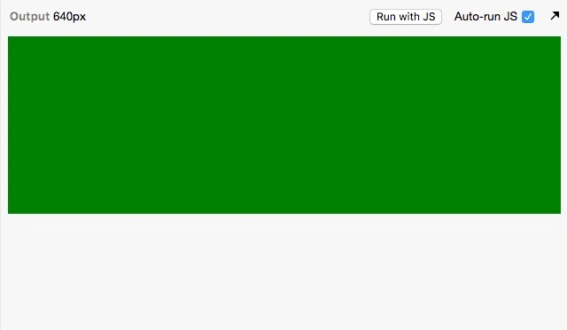
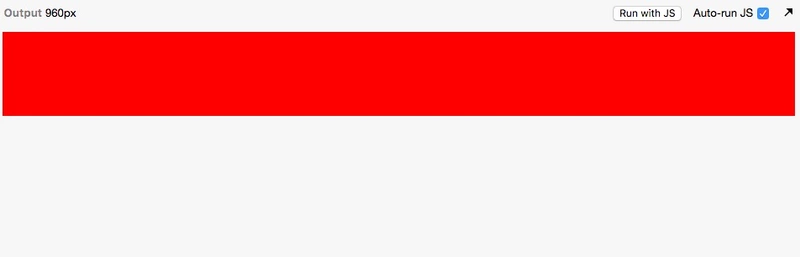

# 移动端布局

Class: css
Created: Sep 24, 2019 4:16 PM
Materials: https://segmentfault.com/a/1190000011358507
Reviewed: No

# 移动端适配

## 媒体查询

如果你需要一张网页能够在PC和移动端都能按照不同的设计稿显示出来，那么你需要做的就是去设置媒体查询。

媒体查询的css标识符是@media，它的媒体类型可以分为：

1. all， 所有媒体
2. braille 盲文触觉设备
3. embossed 盲文打印机
4. print 手持设备
5. projection 打印预览
6. screen 彩屏设备
7. speech ‘听觉’类似的媒体类型
8. tty 不适用像素的设备
9. tv 电视

媒体查询的主要原理：它像是给整个css样式设置了断点，通过给定的条件去判断，在不同的条件下，显示不同的样式。

    @media screen and (min-width: 750px){
      .media{
        height: 100px;
        background: red;
      }
    }
    
    @media (max-width: 750px){
      .media{
        height: 200px;
        background: green;
      }

效果图：

## flex弹性盒子

不管屏幕分辨率怎么发生变化，它的高度和位置都不变，而且里面的元素排布也没有发生变化，总是图标信息在左边和薪资状况在右边。

这就是很明显的，flex布局。flex可以在移动端适配比较简单的，元素比较单一的页面。

[flex布局详解 · Issue #13 · laizimo/zimo-article](https://github.com/laizimo/zimo-article/issues/13)

## rem

这种界面有个特点就是页面元素的复杂度比较高，而使用flex进行布局会导致页面被拉伸，但是上下的高度却没有变化等问题。

[从网易与淘宝的font-size思考前端设计稿与工作流](https://www.cnblogs.com/lyzg/p/4877277.html)