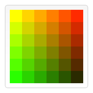

# canvas将图像画到目标图像上的几种方法

Reviewed: No
Status: Css

Canvas API主要聚焦于2D图形。而同样使用<canvas>元素的 WebGL API 则用于绘制硬件加速的2D和3D图形。

# 开始之前

<canvas> 元素有一个叫做 getContext() 的方法，这个方法是用来获得渲染上下文和它的绘画功能。getContext()只有一个参数，上下文的格式。

    var canvas = document.getElementById('tutorial');
    var ctx = canvas.getContext('2d');

# 绘图

## 绘制矩形

    //绘制矩形
    
    //绘制填充的矩形
    
    ctx.fillRect(10,100,100,100);
    
    //清除指定的矩形区域，让清除部分完全透明
    
    ctx.clearRect(20,110,70,70);
    
    //绘制一个矩形边框
    
    ctx.strokeRect(30,120,50,50);

**`rect(*x*, *y*, *width*, *height*)`**

绘制一个左上角坐标为（x,y），宽高为width以及height的矩形。

## 绘制路径

**`beginPath()`**

新建一条路径，生成之后，图形绘制命令被指向到路径上生成路径。

**`closePath()`**

闭合路径之后图形绘制命令又重新指向到上下文中。

**`stroke()`**

通过线条来绘制图形轮廓。

**`fill()`**

通过填充路径的内容区域生成实心的图形。

生成路径的第一步叫做beginPath()。本质上，路径是由很多子路径构成，这些子路径都是在一个列表中，所有的子路径（线、弧形、等等）构成图形。而每次这个方法调用之后，列表清空重置，然后我们就可以重新绘制新的图形。

第二步就是调用函数指定绘制路径

第三，就是闭合路径closePath(),不是必需的。这个方法会通过绘制一条从当前点到开始点的直线来闭合图形。如果图形是已经闭合了的，即当前点为开始点，该函数什么也不做。

注意：当你调用fill()函数时，所有没有闭合的形状都会自动闭合，所以你不需要调用closePath()函数。但是调用stroke()时不会自动闭合。

**`moveTo(*x*, *y*)`**

将笔触移动到指定的坐标x以及y上。

使用moveTo()函数设置起点。我们也能够使用moveTo()绘制一些不连续的路径。

**`[lineTo(x, y)](https://developer.mozilla.org/zh-CN/docs/Web/API/CanvasRenderingContext2D/lineTo)`**

绘制一条从当前位置到指定x以及y位置的直线。

该方法有两个参数：x以及y ，代表坐标系中直线结束的点。

## 绘制圆弧

**`[arc(x, y, radius, startAngle, endAngle, anticlockwise)](https://developer.mozilla.org/zh-CN/docs/Web/API/CanvasRenderingContext2D/arc)`**

画一个以（x,y）为圆心的以radius为半径的圆弧（圆），从startAngle开始到endAngle结束，按照anticlockwise给定的方向（默认为顺时针）来生成。

该方法有六个参数：x,y为绘制圆弧所在圆上的圆心坐标。radius为半径。startAngle以及endAngle参数用弧度定义了开始以及结束的弧度。这些都是以x轴为基准。参数anticlockwise为一个布尔值。为true时，是逆时针方向，否则顺时针方向。

注意：arc()函数中表示角的单位是弧度，不是角度。角度与弧度的js表达式:

弧度=(Math.PI/180)*角度。

**`[arcTo(x1, y1, x2, y2, radius)](https://developer.mozilla.org/zh-CN/docs/Web/API/CanvasRenderingContext2D/arcTo)`**

根据给定的控制点和半径画一段圆弧，再以直线连接两个控制点。

## 二次贝塞尔曲线和三次贝塞尔曲线

**`quadraticCurveTo(cp1x, cp1y, x, y)`**

绘制二次贝塞尔曲线，`cp1x,cp1y`为一个控制点，`x,y为`结束点。

**`bezierCurveTo(cp1x, cp1y, cp2x, cp2y, x, y)`**

绘制三次贝塞尔曲线，`cp1x,cp1y`为控制点一，`cp2x,cp2y`为控制点二，`x,y`为结束点。

二次贝塞尔曲线有一个开始点（蓝色）、一个结束点（蓝色）以及一个控制点（红色），而三次贝塞尔曲线有两个控制点。

# 上色

**`[fillStyle = color](https://developer.mozilla.org/zh-CN/docs/Web/API/CanvasRenderingContext2D/fillStyle)`**

设置图形的填充颜色。

    function draw() {
      var ctx = document.getElementById('canvas').getContext('2d');
      for (var i=0;i<6;i++){
        for (var j=0;j<6;j++){
          ctx.fillStyle = 'rgb(' + Math.floor(255-42.5*i) + ',' + 
                           Math.floor(255-42.5*j) + ',0)';
          ctx.fillRect(j*25,i*25,25,25);
        }
      }
    }

**`[strokeStyle = color](https://developer.mozilla.org/zh-CN/docs/Web/API/CanvasRenderingContext2D/strokeStyle)`**

设置图形轮廓的颜色。

    function draw() {
        var ctx = document.getElementById('canvas').getContext('2d');
        for (var i=0;i<6;i++){
          for (var j=0;j<6;j++){
            ctx.strokeStyle = 'rgb(0,' + Math.floor(255-42.5*i) + ',' + 
                             Math.floor(255-42.5*j) + ')';
            ctx.beginPath();
            ctx.arc(12.5+j*25,12.5+i*25,10,0,Math.PI*2,true);
            ctx.stroke();
          }
        }
      }

## 透明度

方法1：

**`[globalAlpha = transparencyValue](https://developer.mozilla.org/zh-CN/docs/Web/API/CanvasRenderingContext2D/globalAlpha)`**

这个属性影响到 canvas 里所有图形的透明度，有效的值范围是 0.0 （完全透明）到 1.0（完全不透明），默认是 1.0。

方法2：

使用rgba() 方法与 rgb() 方法类似，就多了一个用于设置色彩透明度的参数。它的有效范围是从 0.0（完全透明）到 1.0（完全不透明）。

# 线形

可以通过一系列属性来设置线的样式。

**`[lineWidth = value](https://developer.mozilla.org/zh-CN/docs/Web/API/CanvasRenderingContext2D/lineWidth)`**设置线条宽度。

**`[lineCap = type](https://developer.mozilla.org/zh-CN/docs/Web/API/CanvasRenderingContext2D/lineCap)`**设置线条末端样式。

**`[lineJoin = type](https://developer.mozilla.org/zh-CN/docs/Web/API/CanvasRenderingContext2D/lineJoin)`**设定线条与线条间接合处的样式。

**`[miterLimit = value](https://developer.mozilla.org/zh-CN/docs/Web/API/CanvasRenderingContext2D/miterLimit)`**限制当两条线相交时交接处最大长度；所谓交接处长度（斜接长度）是指线条交接处内角顶点到外角顶点的长度。

**`[getLineDash()](https://developer.mozilla.org/zh-CN/docs/Web/API/CanvasRenderingContext2D/getLineDash)`**返回一个包含当前虚线样式，长度为非负偶数的数组。

**`[setLineDash(segments)](https://developer.mozilla.org/zh-CN/docs/Web/API/CanvasRenderingContext2D/setLineDash)`**设置当前虚线样式。

**`[lineDashOffset = value](https://developer.mozilla.org/zh-CN/docs/Web/API/CanvasRenderingContext2D/lineDashOffset)`**设置虚线样式的起始偏移量。

# 渐变

## 绘制渐变

**`[createLinearGradient(x1, y1, x2, y2)](https://developer.mozilla.org/zh-CN/docs/Web/API/CanvasRenderingContext2D/createLinearGradient)`**

createLinearGradient 方法接受 4 个参数，表示渐变的起点 (x1,y1) 与终点 (x2,y2)。

**`[createRadialGradient(x1, y1, r1, x2, y2, r2)](https://developer.mozilla.org/zh-CN/docs/Web/API/CanvasRenderingContext2D/createRadialGradient)`**

createRadialGradient 方法接受 6 个参数，前三个定义一个以 (x1,y1) 为原点，半径为 r1 的圆，后三个参数则定义另一个以 (x2,y2) 为原点，半径为 r2 的圆。

## 上色

**`[gradient.addColorStop(position, color)](https://developer.mozilla.org/zh-CN/docs/Web/API/CanvasGradient/addColorStop)`**

addColorStop 方法接受 2 个参数，`position` 参数必须是一个 0.0 与 1.0 之间的数值，表示渐变中颜色所在的相对位置。例如，0.5 表示颜色会出现在正中间。`color` 参数必须是一个有效的 CSS 颜色值（如 #FFF， rgba(0,0,0,1)，等等）。

你可以根据需要添加任意多个色标（color stops）。

# 图案样式

**`[createPattern(image, type)](https://developer.mozilla.org/zh-CN/docs/Web/API/CanvasRenderingContext2D/createPattern)`**

该方法接受两个参数。Image 可以是一个 `Image` 对象的引用，或者另一个 canvas 对象。`Type` 必须是下面的字符串值之一：`repeat`，`repeat-x`，`repeat-y` 和 `no-repeat`。

图案的应用跟渐变很类似的，创建出一个 pattern 之后，赋给 fillStyle 或 strokeStyle 属性即可。

# 阴影

**`[shadowOffsetX = float](https://developer.mozilla.org/zh-CN/docs/Web/API/CanvasRenderingContext2D/shadowOffsetX)`**

`shadowOffsetX` 和 `shadowOffsetY` 用来设定阴影在 X 和 Y 轴的延伸距离，它们是不受变换矩阵所影响的。负值表示阴影会往上或左延伸，正值则表示会往下或右延伸，它们默认都为 `0`。

**`[shadowOffsetY = float](https://developer.mozilla.org/zh-CN/docs/Web/API/CanvasRenderingContext2D/shadowOffsetY)`**

shadowOffsetX 和 `shadowOffsetY` 用来设定阴影在 X 和 Y 轴的延伸距离，它们是不受变换矩阵所影响的。负值表示阴影会往上或左延伸，正值则表示会往下或右延伸，它们默认都为 `0`。

**`[shadowBlur = float](https://developer.mozilla.org/zh-CN/docs/Web/API/CanvasRenderingContext2D/shadowBlur)`**

shadowBlur 用于设定阴影的模糊程度，其数值并不跟像素数量挂钩，也不受变换矩阵的影响，默认为 `0`。

**`[shadowColor = color](https://developer.mozilla.org/zh-CN/docs/Web/API/CanvasRenderingContext2D/shadowColor)`**

shadowColor 是标准的 CSS 颜色值，用于设定阴影颜色效果，默认是全透明的黑色。

# 绘制文本

**`[fillText(text, x, y [, maxWidth])](https://developer.mozilla.org/zh-CN/docs/Web/API/CanvasRenderingContext2D/fillText)`**

在指定的(x,y)位置填充指定的文本，绘制的最大宽度是可选的.

**`[strokeText(text, x, y [, maxWidth])](https://developer.mozilla.org/zh-CN/docs/Web/API/CanvasRenderingContext2D/strokeText)`**

在指定的(x,y)位置绘制文本边框，绘制的最大宽度是可选的.

还有更多的属性可以让你改变canvas显示文本的方式：

**`[font = value](https://developer.mozilla.org/zh-CN/docs/Web/API/CanvasRenderingContext2D/font)`**当前我们用来绘制文本的样式. 这个字符串使用和 [CSS](https://developer.mozilla.org/en-US/docs/Web/CSS) `[font](https://developer.mozilla.org/zh-CN/docs/Web/CSS/font)` 属性相同的语法. 默认的字体是 `10px sans-serif`。

**`[textAlign = value](https://developer.mozilla.org/zh-CN/docs/Web/API/CanvasRenderingContext2D/textAlign)`**文本对齐选项. 可选的值包括：`start`, `end`, `left`, `right` or `center`. 默认值是 `start`。

**`[textBaseline = value](https://developer.mozilla.org/zh-CN/docs/Web/API/CanvasRenderingContext2D/textBaseline)`**基线对齐选项. 可选的值包括：`top`, `hanging`, `middle`, `alphabetic`, `ideographic`, `bottom`。默认值是 `alphabetic。`

**`[direction = value](https://developer.mozilla.org/zh-CN/docs/Web/API/CanvasRenderingContext2D/direction)`**文本方向。可能的值包括：`ltr`, `rtl`, `inherit`。默认值是 `inherit。`

**`[measureText()](https://developer.mozilla.org/zh-CN/docs/Web/API/CanvasRenderingContext2D/measureText)`**

将返回一个 `[TextMetrics](https://developer.mozilla.org/zh-CN/docs/Web/API/TextMetrics)`对象的宽度、所在像素，这些体现文本特性的属性。

# 使用图像

引入图像到canvas里需要以下两步基本操作：

1. 获得一个指向`[HTMLImageElement](https://developer.mozilla.org/zh-CN/docs/Web/API/HTMLImageElement)`的对象或者另一个canvas元素的引用作为源，也可以通过提供一个URL的方式来使用图片
2. 使用`drawImage()`函数将图片绘制到画布上

**`[HTMLImageElement](https://developer.mozilla.org/zh-CN/docs/Web/API/HTMLImageElement)`**这些图片是由Image()函数构造出来的，或者任何的元素

**`[HTMLVideoElement](https://developer.mozilla.org/zh-CN/docs/Web/API/HTMLVideoElement)`**用一个HTML的 `[<video>](https://developer.mozilla.org/zh-CN/docs/Web/HTML/Element/video)`元素作为你的图片源，可以从视频中抓取当前帧作为一个图像

**`[HTMLCanvasElement](https://developer.mozilla.org/zh-CN/docs/Web/API/HTMLCanvasElement)`**可以使用另一个 `[<canvas>](https://developer.mozilla.org/zh-CN/docs/Web/HTML/Element/canvas)` 元素作为你的图片源。

**`[ImageBitmap](https://developer.mozilla.org/zh-CN/docs/Web/API/ImageBitmap)`**这是一个高性能的位图，可以低延迟地绘制，它可以从上述的所有源以及其它几种源中生成。

这些源统一由 `[CanvasImageSource](https://developer.mozilla.org/zh-CN/docs/Web/API/CanvasImageSource)`类型来引用。

### 使用相同页面内的图片

我们可以通过下列方法的一种来获得与canvas相同页面内的图片的引用：

- `[document.images](https://developer.mozilla.org/zh-CN/docs/Web/API/Document/images)`集合
- `[document.getElementsByTagName()](https://developer.mozilla.org/zh-CN/docs/Web/API/Document/getElementsByTagName)`方法
- 如果你知道你想使用的指定图片的ID，你可以用`[document.getElementById()](https://developer.mozilla.org/zh-CN/docs/Web/API/Document/getElementById)`获得这个图片

### 使用其它域名下的图片

在 `[HTMLImageElement](https://developer.mozilla.org/zh-CN/docs/Web/API/HTMLImageElement)`上使用[crossOrigin](https://developer.mozilla.org/en-US/docs/HTML/CORS_settings_attributes)属性，你可以请求加载其它域名上的图片。如果图片的服务器允许跨域访问这个图片，那么你可以使用这个图片而不污染canvas，否则，使用这个图片将会[污染canvas](https://developer.mozilla.org/zh-CN/docs/CORS_Enabled_Image#.E4.BB.80.E4.B9.88.E6.98.AF.22.E8.A2.AB.E6.B1.A1.E6.9F.93.22.E7.9A.84canvas)。

### 使用其它 canvas 元素[节](https://developer.mozilla.org/zh-CN/docs/Web/API/Canvas_API/Tutorial/Using_images#Using_other_canvas_elements)

和引用页面内的图片类似地，用 `[document.getElementsByTagName](https://developer.mozilla.org/en/DOM/document.getElementsByTagName)`或 `[document.getElementById](https://developer.mozilla.org/en/DOM/document.getElementById)` 方法来获取其它 canvas 元素。但你引入的应该是已经准备好的 canvas。

    var img = new Image();   // 创建一个元素
    img.src = 'myImage.png'; // 设置图片源地址

## 绘制图片

**`drawImage(image, x, y)`**

其中 `image` 是 image 或者 canvas 对象，`x` 和 `y 是其在目标 canvas 里的起始坐标。`

## 缩放图片

**`[drawImage(image, x, y, width, height)](https://developer.mozilla.org/zh-CN/docs/Web/API/CanvasRenderingContext2D/drawImage)`**

这个方法多了2个参数：`width` 和 `height，`这两个参数用来控制 当向canvas画入时应该缩放的大小

## 切片

**`[drawImage(image, sx, sy, sWidth, sHeight, dx, dy, dWidth, dHeight)](https://developer.mozilla.org/zh-CN/docs/Web/API/CanvasRenderingContext2D/drawImage)`**

第一个参数和其它的是相同的，都是一个图像或者另一个 canvas 的引用。其它8个参数最好是参照右边的图解，前4个是定义图像源的切片位置和大小，后4个则是定义切片的目标显示位置和大小。

[使用图像 Using images](https://developer.mozilla.org/zh-CN/docs/Web/API/Canvas_API/Tutorial/Using_images)